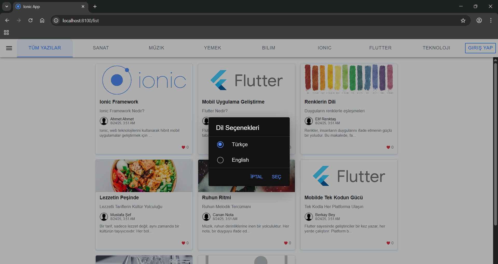
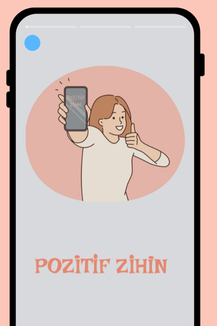
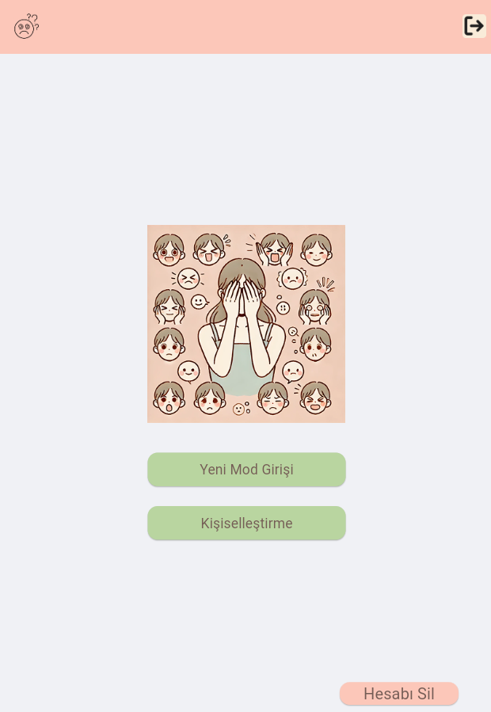
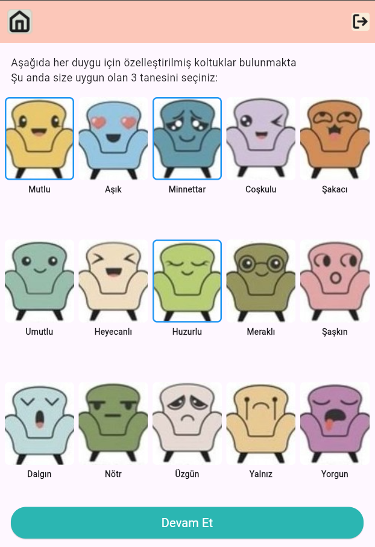

# Hilal Toklu
Herkese kocaman bir merhaba, projelerime göz atmaya hoş geldiniz!

 

🔭 Odak noktam: Gerçek problemleri yapay zekâ çözümleriyle dönüştürmek

🌱 Yolculuğum: ML & NLP dünyasında sürekli yeni şeyler öğrenmek

🎨 İlgi alanlarım: Python, AI/ML, Frontend & Mobile, Blender ile 3D tasarım

📫 Bana ulaşmak için: **htoklu.project@gmail.com**  

---

## 🛠️ Yetkinliklerim  

- Python · TypeScript · Dart · C · Java · C# · SQL · HTML&CSS  
- Veri Bilimi · Makine Öğrenme · Doğal Dil İşleme (NLP) ·  
- Frontend & Mobile: Angular · Ionic · Flutter  
- 3D Modelleme: Blender  
- Git & GitHub · API Entegrasyonu · Veritabanı Yönetimi  

---

## ⚡ Teknolojik Araçlar  

  
  
  
  
  
  
  
  
  
  
  
  

  

---
## 📌 Öne Çıkan Projelerim  

### 📝 **Blog Uygulaması (2025)**  
🔗 GitHub Repo → [Website](https://github.com/hilaltoklu/Website)  

- ✨ *Özellikler:*  
  - Kullanıcı giriş/çıkış  
  - CRUD işlemleri  
  - Çok dilli destek  
  - Tema desteği  
  - Modern UI  

- 🛠️ *Teknolojiler:* **Ionic + Angular**  

📸 *Projenin Örnek Ekran Görüntüleri:*  

  
  

---

### 🌱 **Pozitif Zihin (2025)**  
🔗 GitHub Repo → [PoZi](https://github.com/hilaltoklu/pozitif-zihin)  

- ✨ *Özellikler:*  
  - Yapay zekâ destekli ruh hali takibi  
  - Kişiselleştirilmiş öneriler  
  - Modern mobil arayüz  

- 🖌️ *Frontend:* **Flutter (Dart)** · UI tasarımı: **Figma**  
- ⚙️ *Backend:* **FastAPI · SQLite**  

📸 *Projenin Örnek Ekran Görüntüleri:*  

  
  
  

